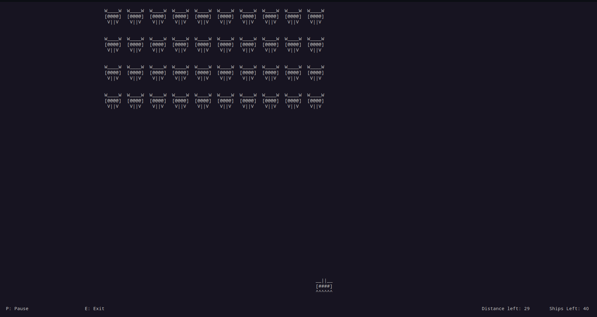
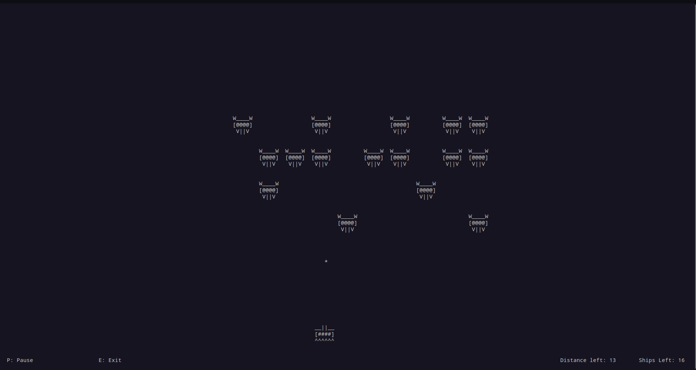

# ASCII Spacewars

Aliens from the planet of Krueldron are approaching planet Earth. They have managed to destroy all of Earth's mightiest armies. You are the sole pilot left. The Krueldronite fleet is fast approaching Earth. The mission is yours to defeat the Krueldronites and save the people of Earth from certain destruction. Do you have what it takes?

# <strong>Introduction</strong>

This is a terminal-based ASCII game similar to the 1978 game Space Invaders. This was written in C++, using the ncurses library. 

<strong>About ncurses</strong>: <a href="https://github.com/mirror/ncurses">ncurses</a>

## <strong>Structure</strong>

The program is divided into 3 files:

1. `functions.cpp`: Contains the basic functions controlling the game mechanics and UI.

2. `functions.hpp`: Contains the function declarations of the functions written in `functions.cpp`.

3. `main.cpp`: Contains `main()`. This is where the program starts and ends execution.

## <strong>Game Objects</strong> 

 

<em>Player Spaceship</em>

 

<em>Enemy Spaceship</em>

## <strong>Setup</strong>

<strong>NOTE: The following commands only work on Debian/Ubuntu Linux. The game will run on other Linux distributions, but the commands must be modified accordingly. Compatibility with Windows OS has not been tested yet.</strong>

### I. Installation

1. In order to compile and run the game, you must have the ncurses library installed. To download the ncurses library on Debian/Ubuntu Linux, type the following command in the terminal:

`sudo apt-get install libncurses5-dev libncursesw5-dev`

2. You can then clone this repository using the following command:

`git clone https://github.com/coniferousdyer/ASCII-Spacewars.git`

You now have everything required to compile and run the game.

### II. Compiling the Game

If you have the g++ compiler, you can use the following commands to compile the game:

`cd ASCII-Spacewars`
 
`g++ *.cpp -o name_of_executable -lncurses`

You can choose to add flags `-O1`, `-O2` or `-O3` at the end of the above command in order to provide different levels of optimization (from lowest to highest).

### III. Running the Game

Use the following command to run the game:

`./name_of_executable`

## <strong>Rules of the Game</strong>

Your mission is to shoot down all the enemy spaceships before they reach the bottom of the screen (i.e. when Distance Left becomes 0). If you fail to do so, you lose. If you shoot them all down in time (i.e. Ships Left becomes 0), you win.

## <strong>Game Instructions</strong>

1. <kbd>&larr;</kbd> to move the spaceship left.
2. <kbd>&rarr;</kbd> to move the spaceship right.
3. <kbd>SPACE</kbd> to shoot bullets.
4. <kbd>P</kbd> to pause the game.
5. <kbd>E</kbd> to exit the game and return to the start menu.

### Warnings

1. Make the terminal full-screen in order to play the game properly. While the game works in a small-screen terminal, the gap between the enemy fleet and the player spaceship will be extremely small, and this will result in the ASCII art getting messed up. Really messed up.

2. The player unfortunately cannot shoot another bullet while one bullet is still travelling.

## <strong>Screenshots</strong>

 

<em>Screenshot 1</em>

 

<em>Screenshot 2</em>

  
Hope you enjoy playing this game!