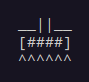
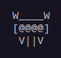

# ASCII Spacewars

This is a terminal-based ASCII game similar to the 1978 game Space Invaders. This was written in C++, using the ncurses library. 

<strong>About ncurses</strong>: <a href="https://github.com/mirror/ncurses">ncurses</a>
  

## <strong>Structure</strong>

The program is divided into 3 files:

1. `functions.cpp`: Contains the basic functions controlling the game mechanics and UI.

2. `functions.hpp`: Contains the function declarations of the functions written in `functions.cpp`.

3. `main.cpp`: Contains `main()`. This is where the program starts execution.
  

## <strong>Game Objects</strong> 

 

Player Spaceship

 

Enemy Spaceship

## <strong>Setup</strong>

 
<strong>NOTE: The following commands only work on Debian/Ubuntu Linux. The game will run on other Linux distributions, but the commands must be modified accordingly. Compatibility with Windows OS has not been tested yet.</strong>
  

### I. Installation

1. In order to compile and run the game, you must have the Ncurses library installed. To download the Ncurses library on Debian/Ubuntu Linux, type the following command in the terminal:

`sudo apt-get install libncurses5-dev libncursesw5-dev`

2. You can then clone this repository using the following command:

`git clone https://github.com/coniferousdyer/ASCII-Spacewars.git`

You now have everything required to compile and run the game.

### II. Compiling the Game

If you have the g++ compiler, you can use the following commands to compile the game:

`cd ASCII-Spacewars`
 
`g++ *.cpp -o name_of_executable -lncurses`

### III. Running the Game

Use the following command to run the game:

`./name_of_executable`
  

## <strong>Rules of the Game</strong>

  

## <strong>Game Instructions</strong>

1. <kbd>&larr;</kbd> to move the spaceship left.
2. <kbd>&rarr;</kbd> to move the spaceship right.
3. <kbd>SPACE</kbd> to shoot bullets.
  

### Warnings

1. Make the terminal full-screen in order to play the game properly. While the game works in a small-screen terminal, the gap between the enemy fleet and the player spaceship will be extremely small, and this will result in the ASCII art getting messed up. Really messed up.

2. The spaceship unfortunately canot move or shoot during the short time for which the bullet travels. Instead, the input buffers up and this results in the spaceship skipping parts of the screen or lagging for a while until all the bullets have been shot. To avoid this, refrain from holding down the keys.